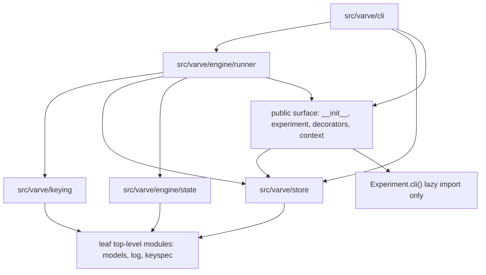

# varve Architecture

## Overview

`varve` is a materialized, content-addressed cache for serial experiment orchestration.

Experiments own output paths and file formats. `varve` owns the store under the output root and
records which stage successfully produced which durable artifacts for a content key. The runner
uses stage declarations, source fingerprints, declared key inputs, file fingerprints, values, and
upstream content keys to decide whether a stage is a cache hit, stale, resumable, dirty, or
missing cached state.

The package is intentionally small. The public API is for experiment authors; the `keying`,
`store`, `engine`, and `cli` packages are internal implementation surfaces.

## Package Layout

```text
src/varve/
├── __init__.py          # Public re-export surface.
├── context.py           # Runtime Ctx passed to stage methods.
├── decorators.py        # @stage, @batch_stage, and StageSpec metadata.
├── experiment.py        # Experiment base class, stage collection, topo order, clean roots, CLI hook.
├── keyspec.py           # JSON type and KeySpec declarations.
├── log.py               # Logger and CLI logging helpers.
├── models.py            # Pydantic models persisted in the store.
├── keying/
│   ├── astkey.py        # Source AST fingerprinting for stage/helper callables.
│   ├── fingerprint.py   # Canonical JSON hashing and file fingerprints.
│   └── keys.py          # Key component assembly, content_key, and run_key.
├── store/
│   ├── lock.py          # Single-writer output-root lock.
│   └── store.py         # Latest-wins snapshot Store and CorruptStore.
├── engine/
│   ├── state.py         # Pure cache-state decision functions.
│   └── runner.py        # Stage selection, key computation, execution, and store writes.
└── cli/
    ├── app.py           # argparse CLI and pydantic-settings Config construction.
    ├── argmap.py        # Config model to CLI flag mapping.
    └── clean.py         # Destructive clean operations and safety checks.
```

Empty package `__init__.py` files under internal subpackages intentionally do not re-export
symbols. Internal imports use full module paths such as `varve.store.store.Store` and
`varve.keying.keys.content_key`.

## Dependency Direction



Rules:

- `keying`, `store`, and `engine.state` stay low level: they do not import each other,
  `engine.runner`, public-surface modules, or `cli`.
- `keying` only depends on leaf top-level modules such as `models`, `log`, and `keyspec`.
- `engine.runner` composes the lower layers and owns orchestration.
- `cli` is the top layer and may call runner, clean, store, and public-facing modules.
- `Experiment.cli()` has the only controlled reverse edge. It lazily imports `varve.cli.app.main`
  inside the method body.

There is no automated import-direction checker. Dependency direction is enforced by this document
and code review.

## Public API vs Internal Surface

The public API is exactly the seven names exported from `varve.__all__`:

```python
Ctx
Experiment
JSON
KeySpec
StageSpec
batch_stage
stage
```

Experiment authors should be able to write:

```python
from varve import Ctx, Experiment, JSON, KeySpec, StageSpec, batch_stage, stage
```

Internal surfaces include `Store`, `CorruptStore`, `run_key`, `content_key`, `Manifest`,
`SuccessRecord`, `PartialMeta`, `BatchRecord`, `AttemptMarker`, `StageOutcome`, and CLI helper
functions. They may be imported by internal modules and tests through their full paths, but they
are not exported from `varve`.

`Ctx(..., ledger=...)` is only a legacy keyword alias for `Ctx(..., store=...)`. Internal runner
code passes `store=`.

## Cache Semantics Overview

The store lives at:

```text
<output_root>/.varve/
├── manifest.json
├── .gitignore
├── lock                 # OS file-lock marker for the active writer.
├── stages/<stage>.json
├── attempts/<stage>.json
└── partial/<stage>/<run_key>/
    ├── meta.json
    └── batches/<index>.json
```

`Store` is a latest-wins snapshot store:

- `stages/<stage>.json` stores the current successful record for a stage.
- `attempts/<stage>.json` records an in-progress or interrupted attempt marker.
- `partial/<stage>/<run_key>/` stores resumable batch scratch for a specific content key and
  partition.

There is no append-only history.

Recorded artifact paths are output-root-relative. Static `@stage(produces=...)` declarations are
resolved against `ctx.out`. Batch stages may yield absolute paths under `ctx.out` or paths already
relative to `ctx.out`; relative batch paths are not current-working-directory-relative.

### Keys

`content_key` hashes a canonical JSON view of:

- normalized source hashes for the stage function and any declared `uses` helpers;
- declared config fields from `KeySpec.config`;
- sha256 digests for declared files from `KeySpec.files`;
- declared JSON values from `KeySpec.values`;
- upstream stage content keys.

File fingerprint metadata stores path, size, mtime, and sha256. The content key only folds in file
digests. On a cache hit, runner may refresh stored size/mtime metadata when digests are unchanged.

`run_key` hashes the `content_key` together with batch `partition_values`. It is used to locate
partial batch scratch for resume.

### Status Values

`engine.state.Status` declares:

```text
dirty
hit
artifact-missing
stale
no-cache
resume
unrecoverable
corrupt-store
```

Current code declares `corrupt-store` as a status literal, but no runner path produces that status
today. Malformed store files raise `CorruptStore` from `varve.store.store`.

### Decision Inputs

Cache decisions are pure functions in `engine.state` and are driven by:

- the current content key and key components;
- the latest success record, if any;
- the attempt marker, if any;
- artifact existence under the output root;
- batch partial records and `run_key`;
- batch partition values.

Runner adds orchestration-specific inputs around those decisions: selected stages, upstream
success records, `force`, `dry`, output locking, and actual stage execution.

### Decision Boundaries

- `hit`: success record content key matches and recorded artifacts exist.
- `dirty`: an attempt marker exists, so cached success is not trusted. When a batch stage has no
  success record but does have partial scratch, runner currently does not pass the attempt marker
  into the batch decision, so the stage can resume or rerun from `no-cache`.
- `artifact-missing`: success key matches but some recorded artifacts are missing. Batch stages
  may skip still-existing indexes through `Ctx.resume`.
- `stale`: a success record exists but its content key differs from the current key. The reason is
  computed from source, config, files, values, or upstream differences.
- `no-cache`: there is no success record and no matching partial scratch.
- `resume`: a batch stage has matching partial scratch and no success record.
- `unrecoverable`: a batch success key matches but artifacts are missing after partition values
  changed, so runner cannot safely map existing artifacts to current partitions.

`force=True` overrides the decision to rerun as `stale` when a previous success exists or
`no-cache` when it does not. `dry=True` computes status without executing stages or writing store
records.

## CLI Architecture

`Experiment.cli(argv)` delegates to `varve.cli.app.main`.

The CLI uses `argparse` for command parsing:

- `run [target]`
- `status [target]`
- `clean [target]`
- `plan [target]`
- `list`

`run`, `status`, and `clean` require an experiment `Config`. `plan` and `list` do not construct a
`Config`; they can still run when the config model contains fields not supported by argmap.

`argmap` registers supported config fields as CLI flags:

- scalar fields become `--field-name`;
- nested `BaseModel` fields become dotted flags such as `--inner.name`;
- bool fields support positive and negative flags, such as `--enabled` and `--no-enabled`;
- list fields accept JSON through `json.loads`;
- unsupported dict, mapping, tuple, set, and union shapes fail fast for config commands.

Command flags and config fields are kept separate by using private argparse destinations for config
flags. This prevents command arguments such as `run TARGET` or `--force` from polluting same-named
config fields.

Unknown options are strict. Before dynamic config flags are registered, config commands pre-scan
the selected command's arguments so unknown options or missing option values fail as parser errors
instead of triggering config registration for the wrong command.

## Config Sources and Priority

`cli.app._settings_type()` builds a temporary `BaseSettings` subclass around the experiment
`Config` model.

Practical source priority is:

```text
CLI flag > env > dotenv (.env) > yaml (--config) > field default
```

Implementation details:

- CLI flags are passed as settings init kwargs collected by argmap.
- Environment variables are read by pydantic-settings.
- Nested environment names use `env_nested_delimiter="__"`.
- `.env` is enabled with `env_file=".env"` and is read from the current working directory.
- YAML is added through `YamlConfigSettingsSource` only when `--config` is provided.
- The resulting settings model is dumped and validated back into the experiment `Config` type.

Nested fields deep-merge across sources. The current `model_config` does not enable
`nested_model_default_partial_update`; nested merge behavior relies on pydantic-settings source
deep merge, not on partial mutation of nested default model instances.

## Clean Security Model

All clean operations acquire the output-root lock and validate the manifest anchor:

- `.varve/manifest.json` must exist.
- The manifest experiment name must match the current experiment class name.

Full clean (`target is None`) then:

- calls `_validate_destructive(root, allowed_roots)`;
- rejects empty roots, `/`, the home directory, and the current working directory;
- applies `allowed_roots` if provided;
- requires `_confirm` unless `yes=True`;
- removes the whole output root.

Experiments declare business-allowed full-clean roots by overriding
`Experiment.clean_roots(config)`. The CLI passes that value into `clean(..., allowed_roots=...)`.
The default is `None`, which leaves only the dangerous-root blacklist and manifest anchor guard.

Per-stage clean (`target is not None`) then:

- checks that the target stage exists;
- expands the downstream closure from the target;
- reads success records for that closure;
- validates recorded output paths stay under the output root;
- requires `_confirm` unless `yes=True`;
- deletes recorded artifacts, stage success records, attempt markers, and partial scratch for the
  selected closure.

`allowed_roots` does not apply to per-stage clean. Its safety boundary is manifest anchor plus
success-record path closure.

## Known Limitations

- Source AST fingerprints use `ast.dump`. The normalized dump can change across CPython versions,
  so a Python upgrade may invalidate source hashes and force rebuilds.
- `corrupt-store` is declared in the `Status` literal set, but current code does not produce that
  status. Corrupt store files raise `CorruptStore` directly.

## Non-Goals

- No import-linter or automated dependency-direction checker.
- No studies dependency, migration layer, or workspace-specific consumer behavior inside this
  package.
- No broad external backward-compatibility guarantee beyond the documented public API while there
  are no external consumers.
