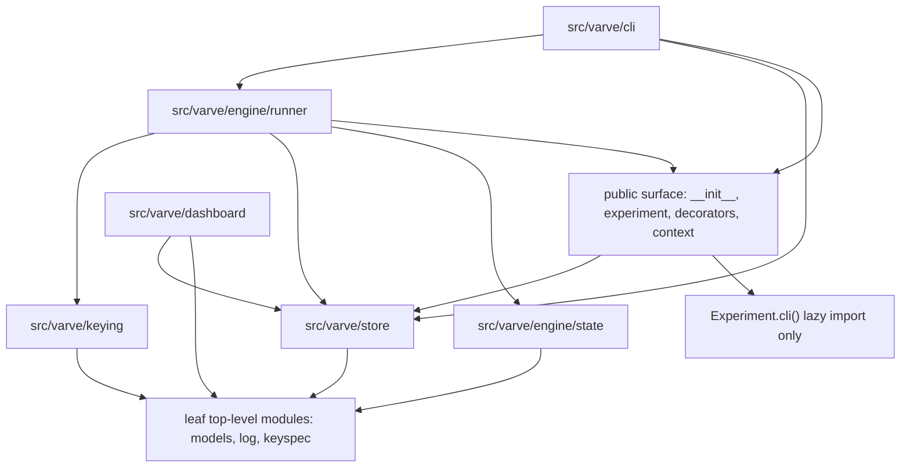

# varve Architecture

## Overview

`varve` is a materialized, content-addressed cache for serial experiment orchestration.

Experiments own output formats and default output-base policy. `varve` owns branch-aware output root resolution, `ctx.out`, and the store under the output root. The store records which stage successfully produced which durable artifacts for a content key. The runner uses stage declarations, source fingerprints, the full Config, file fingerprints, values, and upstream content keys to decide whether a stage is a cache hit, stale, resumable, dirty, or missing cached state.

The package is intentionally small. The public API is for experiment authors; the `keying`, `store`, `engine`, and `cli` packages are internal implementation surfaces.

## Package Layout

```text
src/varve/
├── __init__.py          # Public re-export surface.
├── context.py           # Runtime Ctx passed to stage methods.
├── decorators.py        # @stage, @batch_stage, and StageSpec metadata.
├── branch.py            # Branch name validation, branch config loading, and override merging.
├── experiment.py        # Experiment base class, branch-aware output roots, stage collection, CLI hook.
├── keyspec.py           # JSON type and KeySpec declarations.
├── log.py               # Logger and CLI logging helpers.
├── models.py            # Pydantic models persisted in the store.
├── keying/
│   ├── astkey.py        # Source AST fingerprinting for stage/helper callables.
│   ├── fingerprint.py   # Canonical JSON hashing and file fingerprints.
│   └── keys.py          # Key component assembly, content_key, and run_key.
├── store/
│   ├── lock.py          # Single-writer output-root lock.
│   └── store.py         # Latest-wins snapshot Store and CorruptStore.
├── engine/
│   ├── state.py         # Pure cache-state decision functions.
│   └── runner.py        # Stage selection, key computation, execution, and store writes.
├── dashboard/
│   ├── discovery.py     # Zero-import store discovery under a scan root.
│   ├── state.py         # Read-only store snapshot loading and DAG reconstruction.
│   ├── render.py        # Rich overview and detail rendering.
│   └── cli.py           # Top-level varve ls/show entry point.
└── cli/
    ├── app.py           # argparse CLI and pydantic-settings Config construction.
    ├── argmap.py        # Args model to CLI flag mapping.
    └── clean.py         # Destructive clean operations and safety checks.
```

Empty package `__init__.py` files under internal subpackages intentionally do not re-export symbols. Internal imports use full module paths such as `varve.store.store.Store` and `varve.keying.keys.content_key`.

## Dependency Direction



Rules:

- `keying`, `store`, and `engine.state` stay low level: they do not import each other, `engine.runner`, public-surface modules, or `cli`.
- `keying` only depends on leaf top-level modules such as `models`, `log`, and `keyspec`.
- `engine.runner` composes the lower layers and owns orchestration.
- `dashboard` is a read-only top-level package. It may read `store` and persisted `models`, but no lower layer imports `dashboard`, and `dashboard` must not depend on `engine.runner`.
- `cli` is the top layer and may call runner, clean, store, and public-facing modules.
- `Experiment.cli()` has the only controlled reverse edge. It lazily imports `varve.cli.app.main` inside the method body.

There is no automated import-direction checker. Dependency direction is enforced by this document and code review.

## Public API vs Internal Surface

The public API is exactly the seven names exported from `varve.__all__`:

```python
Ctx
Experiment
JSON
KeySpec
StageSpec
batch_stage
stage
```

Experiment authors should be able to write:

```python
from varve import Ctx, Experiment, JSON, KeySpec, StageSpec, batch_stage, stage
```

Internal surfaces include `Store`, `CorruptStore`, `run_key`, `content_key`, `Manifest`, `SuccessRecord`, `PartialMeta`, `BatchRecord`, `AttemptMarker`, `StageOutcome`, and CLI helper functions. They may be imported by internal modules and tests through their full paths, but they are not exported from `varve`.

`Ctx(..., ledger=...)` is only a legacy keyword alias for `Ctx(..., store=...)`. Internal runner code passes `store=`.

## Cache Semantics Overview

The store lives at:

```text
<output_root>/.varve/
├── manifest.json
├── .gitignore
├── lock                 # OS file-lock marker for the active writer.
├── stages/<stage>.json
├── attempts/<stage>.json
└── partial/<stage>/<run_key>/
    ├── meta.json
    └── batches/<index>.json
```

`Store` is a latest-wins snapshot store:

- `stages/<stage>.json` stores the current successful record for a stage.
- `attempts/<stage>.json` records an in-progress or interrupted attempt marker.
- `partial/<stage>/<run_key>/` stores resumable batch scratch for a specific content key and partition.

There is no append-only history.

Recorded artifact paths are output-root-relative. Static `@stage(produces=...)` declarations are resolved against `ctx.out`. Batch stages may yield absolute paths under `ctx.out` or paths already relative to `ctx.out`; relative batch paths are not current-working-directory-relative.

The output root is not part of the experiment `Config`. `run`, `status`, and `clean` resolve an output base from explicit `--out`/`cli_out` when present, otherwise from `Experiment.default_output_root(config)`. varve then appends the selected branch: `base/<branch>` for persistent branches and `base/.tmp/<branch>` for temporary override branches. The resolved value is used for `Store(out)` and every stage `Ctx(out=out, args=args)`.

`Ctx.resume(iterable, progress=True, desc=..., unit=..., total=..., postfix=...)` keeps resume semantics unchanged while showing one `tqdm` progress bar for the whole resumed iterable. The bar is enabled by default and labeled with the stage name; skipped indexes seed its initial value, so resumed runs do not restart the displayed count from zero. Pass `progress=False` to disable it.

### Keys

`content_key` hashes a canonical JSON view of:

- normalized source hashes for the stage function and any declared `uses` helpers;
- the full experiment Config;
- sha256 digests for declared files from `KeySpec.files`;
- declared JSON values from `KeySpec.values`;
- upstream stage content keys.

File fingerprint metadata stores path, size, mtime, and sha256. The content key only folds in file digests. On a cache hit, runner may refresh stored size/mtime metadata when digests are unchanged.

Config models must not contain `Path` fields or Path values. Input locations belong in `Args`, and input content belongs in the content key through `KeySpec.files`.

Same-module helper functions directly called by a stage or by a declared helper must also be listed in `uses`. This guard covers direct same-module global function calls; aliases, methods, indirect calls, closures, and decorator wrappers are not detected.

`run_key` hashes the `content_key` together with batch `partition_values`. It is used to locate partial batch scratch for resume.

### Status Values

`engine.state.Status` declares:

```text
dirty
hit
artifact-missing
stale
no-cache
resume
unrecoverable
corrupt-store
```

Current code declares `corrupt-store` as a status literal, but no runner path produces that status today. Malformed store files raise `CorruptStore` from `varve.store.store`.

### Decision Inputs

Cache decisions are pure functions in `engine.state` and are driven by:

- the current content key and key components;
- the latest success record, if any;
- the attempt marker, if any;
- artifact existence under the output root;
- batch partial records and `run_key`;
- batch partition values.

Runner adds orchestration-specific inputs around those decisions: selected stages, upstream success records, `force`, `dry`, output locking, and actual stage execution.

### Decision Boundaries

- `hit`: success record content key matches and recorded artifacts exist.
- `dirty`: an attempt marker exists, so cached success is not trusted. When a batch stage has no success record but does have partial scratch, runner currently does not pass the attempt marker into the batch decision, so the stage can resume or rerun from `no-cache`.
- `artifact-missing`: success key matches but some recorded artifacts are missing. Batch stages may skip still-existing indexes through `Ctx.resume`.
- `stale`: a success record exists but its content key differs from the current key. The reason is computed from source, config, files, values, or upstream differences.
- `no-cache`: there is no success record and no matching partial scratch.
- `resume`: a batch stage has matching partial scratch and no success record.
- `unrecoverable`: a batch success key matches but artifacts are missing after partition values changed, so runner cannot safely map existing artifacts to current partitions.

`force=True` overrides the decision to rerun as `stale` when a previous success exists or `no-cache` when it does not. `dry=True` computes status without executing stages or writing store records.

## CLI Architecture

`Experiment.cli(argv)` delegates to `varve.cli.app.main`.

The CLI uses `argparse` for command parsing:

- `run [target] [--out path]`
- `status [target] [--out path]`
- `clean [target] [--out path]`
- `plan [target]`
- `list`

`run`, `status`, and `clean` require an experiment `Config` and `Args`. `plan` and `list` do not construct either model; they can still run when the models contain fields not supported by argmap.

`argmap` registers supported Args fields as CLI flags:

- scalar fields become `--field-name`;
- nested `BaseModel` fields become dotted flags such as `--inner.name`;
- bool fields support positive and negative flags, such as `--enabled` and `--no-enabled`;
- list fields accept JSON through `json.loads`;
- unsupported dict, mapping, tuple, set, and union shapes fail fast for config commands.

Command flags and Args fields are kept separate by using private argparse destinations for generated flags. This prevents command arguments such as `run TARGET` or `--force` from polluting same-named Args fields.

`--out`, `--branch`, `--override`, and `--name` are built-in command options for `run`, `status`, and `clean`. They are not generated from experiment models, and experiment Config models should not declare output-root or branch-selection fields.

Unknown options are strict. Before dynamic Args flags are registered, config commands pre-scan the selected command's arguments so unknown options or missing option values fail as parser errors instead of triggering config registration for the wrong command.

## Dashboard

The top-level `varve` console script provides a read-only dashboard over existing stores:

- `varve ls [--root DIR]` discovers `<experiment>/out/<branch>/.varve/manifest.json` files under the scan root and prints an overview table.
- `varve show <experiment_id> [--root DIR] [--branch NAME]` prints one store's stage details and dependency edges.

Discovery is intentionally zero-import. The dashboard does not import experiment modules, build a `Config`, call runner, or perform dry-run cache decisions. It reads only the store under each branch output root, so the reported status is a latest snapshot of recorded stages. Stores outside the branch output layout are skipped.

- `ok`: a success record exists and every recorded artifact path still exists.
- `artifact-missing`: a success record exists but at least one recorded artifact is missing.
- `interrupted`: an attempt marker exists, with or without an older success record.
- `corrupt`: a stage store file is malformed, or the manifest could not provide an experiment name.
- `empty`: the manifest exists but no stage success or attempt records exist.

Stage discovery uses the union of `.varve/stages/*.json` and `.varve/attempts/*.json`, so a stage that interrupted before its first success record is still visible. Single-stage artifacts are read from `SuccessRecord.produces`; batch artifacts are read from `SuccessRecord.outputs`.

The detail view rebuilds dependency edges from `SuccessRecord.key_components.upstreams`. The topological order only includes stages present in the store, and edges are printed only when both endpoints are recorded. The dashboard cannot see stages that were declared but never run, and it does not recompute source fingerprints or content keys to detect stale source or key-input changes.

## Args and Config Sources

`cli.app._settings_type()` builds a temporary `BaseSettings` subclass around the experiment `Config` model.

Config sources only construct semantic configuration. Output-root selection is resolved separately by the runner and clean paths. Args are built directly from generated CLI flags and model defaults.

`branches.yaml` is discovered next to the experiment module by default, unless `--config PATH` points to another branches file. The selected branch mapping is passed as settings init kwargs. `--override JSON` deep-merges over the selected branch and derives a temporary branch name.

Practical source priority is:

```text
branch or override value > env > dotenv (.env) > field default
```

Implementation details:

- Branch values are passed as settings init kwargs.
- Environment variables are read by pydantic-settings.
- Nested environment names use `env_nested_delimiter="__"`.
- `.env` is enabled with `env_file=".env"` and is read from the current working directory.
- The resulting settings model is dumped and validated back into the experiment `Config` type.

Nested fields deep-merge across sources. The current `model_config` does not enable `nested_model_default_partial_update`; nested merge behavior relies on pydantic-settings source deep merge, not on partial mutation of nested default model instances.

## Clean Security Model

All clean operations acquire the output-root lock and validate the manifest anchor:

- `.varve/manifest.json` must exist.
- The manifest experiment name must match the current experiment class name.

Full clean (`target is None`) then:

- calls `_validate_destructive(root, allowed_roots)`;
- rejects empty roots, `/`, the home directory, and the current working directory;
- applies `allowed_roots` if provided;
- requires `_confirm` unless `yes=True`;
- removes the whole output root.

Experiments declare business-allowed full-clean roots by overriding `Experiment.clean_roots(config)`. The CLI passes that value into `clean(..., allowed_roots=...)`. The default is `None`, which leaves only the dangerous-root blacklist and manifest anchor guard.

Per-stage clean (`target is not None`) then:

- checks that the target stage exists;
- expands the downstream closure from the target;
- reads success records for that closure;
- validates recorded output paths stay under the output root;
- requires `_confirm` unless `yes=True`;
- deletes recorded artifacts, stage success records, attempt markers, and partial scratch for the selected closure.

`allowed_roots` does not apply to per-stage clean. Its safety boundary is manifest anchor plus success-record path closure.

## Known Limitations

- Source AST fingerprints use `ast.dump`. The normalized dump can change across CPython versions, so a Python upgrade may invalidate source hashes and force rebuilds.
- `corrupt-store` is declared in the `Status` literal set, but current code does not produce that status. Corrupt store files raise `CorruptStore` directly.

## Non-Goals

- No import-linter or automated dependency-direction checker.
- No studies dependency, migration layer, or workspace-specific consumer behavior inside this package.
- No broad external backward-compatibility guarantee beyond the documented public API while there are no external consumers.
